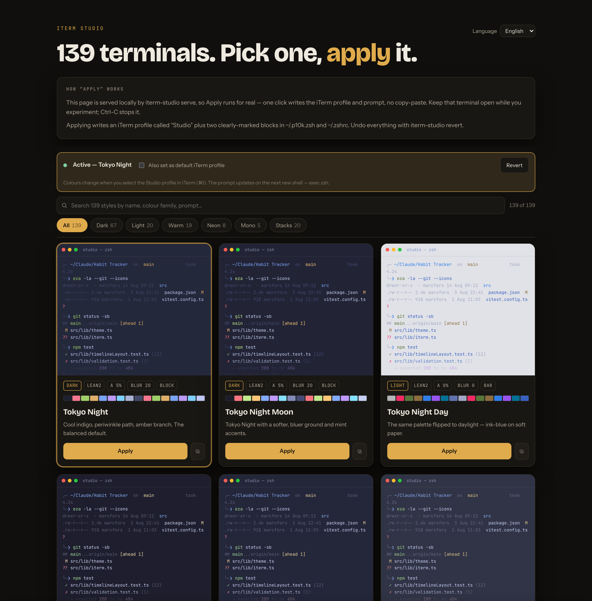
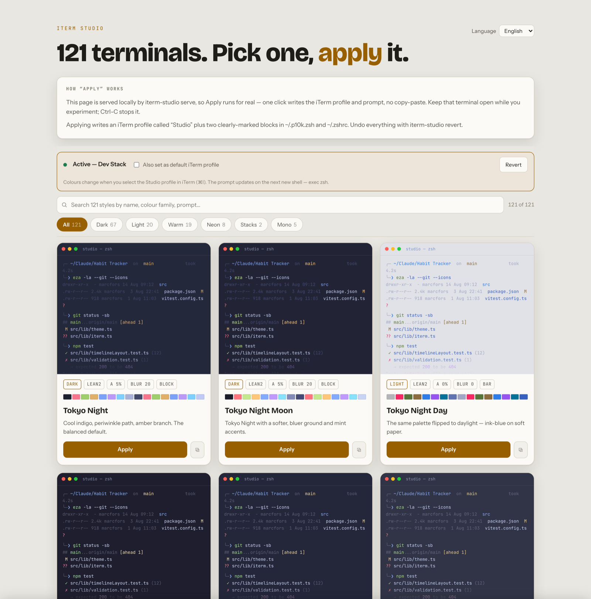
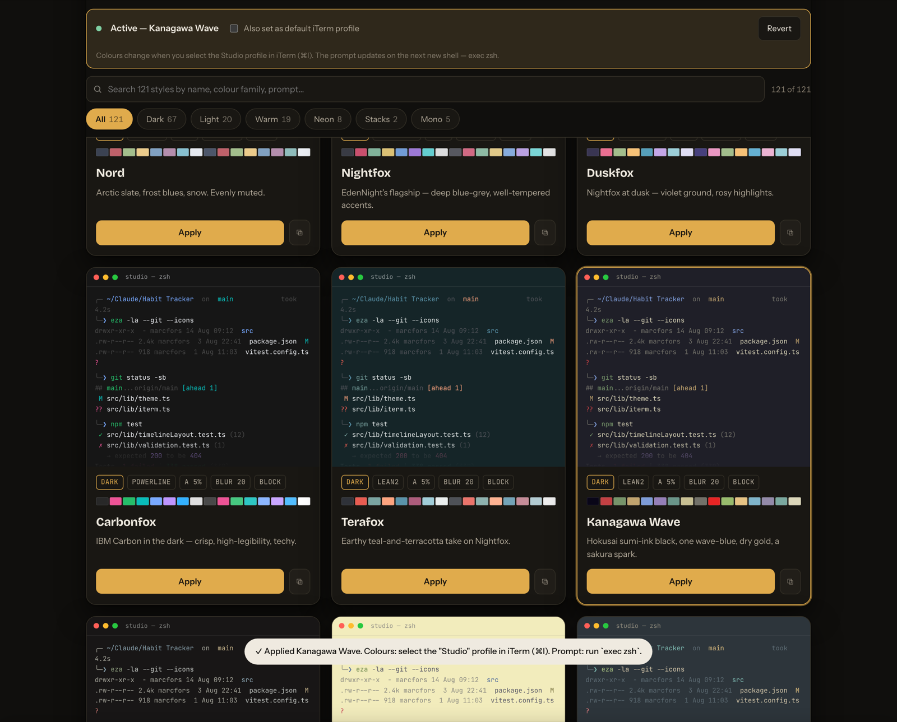
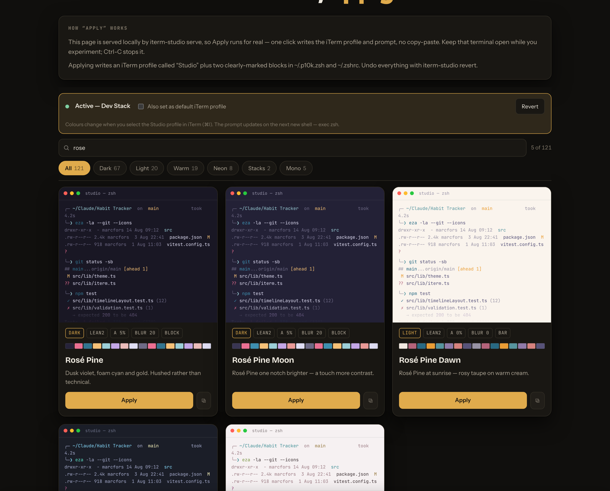
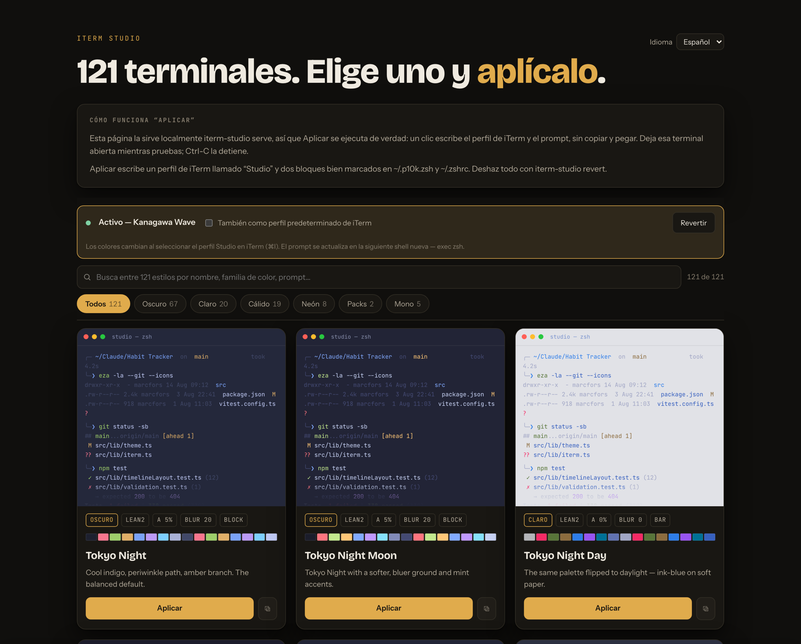

# iTerm Studio

Pick a terminal look from **139 presets** and apply it to this Mac — colours,
transparency, blur, cursor, font, and a matching Powerlevel10k prompt — in one
click.

**Browse all 139 → https://marcfs31.github.io/iterm-studio/**

[](https://github.com/marcfs31/iterm-studio/actions/workflows/ci.yml)
[](https://github.com/marcfs31/iterm-studio/actions/workflows/pages.yml)
[](https://marcfors.com/donate?from=iterm-studio)

The hosted page is the read-only gallery — each **Apply** copies the exact
command. For real one-click applying, run `iterm-studio serve` locally (below).

## About

Trying a new terminal look on macOS normally means three chores in three places:
hand-editing an `.itermcolors` profile, finding a Nerd Font, and re-running
`p10k configure` — and undoing it later is guesswork. **iTerm Studio turns the
whole look into one atomic, reversible operation.**

- **`build.py`** is the single source of truth: **139 presets** compiled to
  `presets.json`. Roughly two-thirds are faithful ports of well-known schemes
  (Tokyo Night, Catppuccin, Rosé Pine, Gruvbox, Kanagawa, Nightfox, Dracula,
  Nord, Solarized, Ayu, Material, GitHub, Monokai, Night Owl, …); the rest are
  procedurally generated single-hue palettes (Ember, Moss, Lagoon, Iris, Nebula,
  Mono Amber, Blueprint, …). Six families — **dark 67 · light 20 · warm 19 ·
  neon 8 · mono 5 · stacks 20** — and five Powerlevel10k prompt shapes
  (`lean2`, `powerline`, `pill`, `minimal`, `rainbow`) with a right-aligned
  command-execution-time segment.
- **Two front-ends, one page.** The static gallery on GitHub Pages lets you
  compare all 139 (every preview is the *same* shell session, so you judge
  colour not content) and copy the command. `iterm-studio serve` serves the
  identical page from `127.0.0.1`, where the buttons hit a tiny local API and
  **apply for real on one click** — with a live "what's active" bar and a
  **Revert** button.
- **Applying is a few marker-delimited pieces it fully owns:** an iTerm2 Dynamic
  Profile named *Studio*, a block in `~/.p10k.zsh` (prompt), a block in
  `~/.zshrc` (highlight colours) — and, for a **stack** preset, a fourth block
  with that stack's shell hooks and aliases. `iterm-studio revert` removes
  exactly those and restores your previous default profile; your original
  `~/.p10k.zsh` is copied to `~/.p10k.zsh.iterm-studio-orig` first. Nothing else
  in your dotfiles is touched.
- **20 stacks** pair a theme with a purpose-built tool bundle — *Modern CLI*,
  *Git Power*, *Cloud Native*, *Data Wrangler*, *Python / Node / Rust / Go Dev*,
  *Observability*, *Security*, *Network*, *Editor TUI*, … `apply <stack>
  --with-tools` `brew install`s the bundle; either way the shell integration
  (`zoxide`/`atuin`/`fzf`/`direnv` hooks, `ls`→`eza`, `cat`→`bat`, …) is wired
  into the managed block, guarded so a missing tool is a no-op.
- **No runtime dependencies.** `iterm-studio` is a single Python 3.9+ script,
  standard library only — it runs on a clean macOS with no `pip install`.

The picker also has live search, category filters, keyboard-accessible controls,
`prefers-reduced-motion` / `prefers-color-scheme` support, and an
**English / Español** toggle.

## Screenshots

The gallery, in the viewer's light or dark theme:

| Dark | Light |
|---|---|
|  |  |

One-click apply when served locally — the status bar tracks what's active and
the toast confirms the profile and prompt were written:



Live search + category filters, and the fully-translated Spanish UI:

| Search & filter | Español |
|---|---|
|  |  |

## Quick start

```bash
make link          # symlink ./iterm-studio into ~/.local/bin (once)
iterm-studio serve  # opens http://127.0.0.1:8787 in your browser
```

Click a card's **Apply**. It runs for real — no copy-paste. Keep the terminal
open while you experiment; `Ctrl-C` stops the server.

The picker has live search, category filters (dark / light / warm / neon / mono /
stacks), and an English / Español toggle. Every preview shows the *same* shell
session so you're comparing colour, not content.

### Command line

```bash
iterm-studio list
iterm-studio apply kanagawa
iterm-studio apply dev-stack --with-tools      # also `brew install`s the toolbelt
iterm-studio apply tokyo-night --set-default   # make "Studio" the default iTerm profile
iterm-studio revert
iterm-studio current
iterm-studio version
```

## What "apply" changes

| Target | What |
|---|---|
| `~/Library/Application Support/iTerm2/DynamicProfiles/iterm-studio.json` | an iTerm2 profile named **Studio** — 16 ANSI colours + fg/bg/cursor/selection, transparency, blur, cursor shape, font, unlimited scrollback |
| `~/.p10k.zsh` | a block between `# >>> iterm-studio prompt >>>` markers — prompt shape (`lean2` / `powerline` / `pill` / `minimal` / `rainbow`) + palette + a `command_execution_time` segment |
| `~/.zshrc` | a block between `# >>> iterm-studio shell >>>` markers — zsh-syntax-highlighting + autosuggestion colours to match |
| `~/.zshrc` | *stack presets only* — a `# >>> iterm-studio tools >>>` block with the stack's shell hooks (`eval "$(zoxide init zsh)"` …) and aliases |

Colours show once you select the **Studio** profile in iTerm (⌘I), or pass
`--set-default`. The prompt updates on the next new shell (`exec zsh`).

`iterm-studio revert` deletes the profile and every managed block and restores
the previous default-profile GUID. Your original `~/.p10k.zsh` is also kept at
`~/.p10k.zsh.iterm-studio-orig`.

## Stacks

Twenty presets bundle a theme with a curated set of Homebrew tools for a
workflow:

| Stack | Bundle |
|---|---|
| **Modern CLI** | eza · bat · fd · fzf · zoxide · git-delta |
| **Dev Stack** | Modern CLI + atuin + btop |
| **Fast Path** | eza · bat · fd · ripgrep · fzf · zoxide (speed picks only) |
| **Git Power** | lazygit · gitui · gh · difftastic · git-delta · git-absorb |
| **Cloud Native** | kubectl · k9s · kubectx · helm · stern · opentofu |
| **Container Ops** | lazydocker · dive · ctop |
| **Infra as Code** | opentofu · terragrunt · tflint · ansible |
| **Data Wrangler** | jq · yq · jless · fx · miller · csvlens · visidata |
| **Python Dev** | uv · ruff · pipx · ipython · pyenv |
| **Node Dev** | fnm · pnpm · deno · watchman |
| **Rust Dev** | rustup · bacon · hyperfine · tokei |
| **Go Dev** | go · golangci-lint · delve · goreleaser |
| **Observability** | bottom · procs · dust · duf · bandwhich |
| **Search & Nav** | ripgrep · fd · fzf · zoxide · broot · tlrc |
| **Editor TUI** | neovim · tmux · lazygit · fzf · ripgrep |
| **Shell Sugar** | zoxide · atuin · fzf · thefuck · direnv |
| **Docs Writer** | glow · pandoc · vale · lychee |
| **Security** | gitleaks · trivy · grype · age · sops |
| **Network** | httpie · xh · curlie · doggo · gping |
| **Media** | ffmpeg · imagemagick · yt-dlp · exiftool · chafa |

```bash
iterm-studio apply data-wrangler --with-tools   # theme + brew install the bundle
iterm-studio apply data-wrangler                # theme + wire the hooks; install later
```

Switching to a non-stack theme removes the tools block; `revert` removes
everything.

## Power-ups

The picker also has a shelf of standalone tools — starship, eza, bat, fzf,
zoxide, atuin, git-delta, tmux, btop, tlrc, thefuck, nerd-fonts — each a
one-click `brew install` in `serve` mode.

## Local server security

Binds `127.0.0.1` only. Every `/api/*` call needs a random per-run token
embedded in the served page, plus a `Host` / `Origin` allow-list (DNS-rebinding
guard). Preset ids and tool names are allow-listed. The server runs only while
you keep it open.

## Development

```bash
make build    # regenerate presets.json / presets.js  (edit build.py, never the JSON)
make test     # unit tests + app.html JS syntax check
make lint     # ruff + py_compile
```

See [CONTRIBUTING.md](CONTRIBUTING.md). Standard library only — `iterm-studio`
must run on a clean macOS with no `pip install`.

## Files

| File | Role |
|---|---|
| `iterm-studio` | CLI + local one-click server (Python 3.9+, stdlib only) |
| `build.py` | source of truth for the 139 presets |
| `presets.json` / `presets.js` | generated — committed, never hand-edited |
| `app.html` | the picker UI (`__MODE__` = `local` when served, `web` when published) |
| `tests/` | run by CI (`.github/workflows/ci.yml`) and `make test` |

## License

[MIT](LICENSE) © 2026 Marc Fors

If this project is useful to you, you can [support it with 1,99 €](https://marcfors.com/donate?from=iterm-studio).
